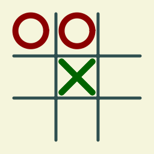
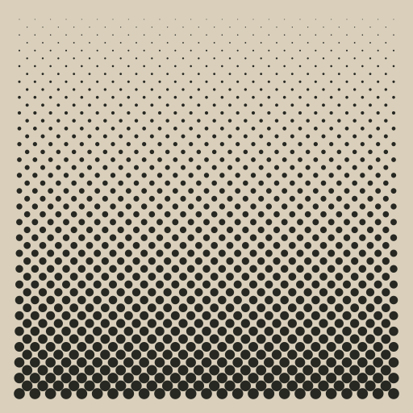
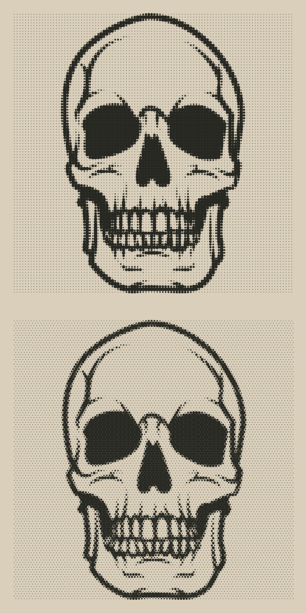

# Graphische Trainingseinheiten

In diesem Verzeichnis sind mehrere Aufgaben enthalten, die graphisch
implementiert werden müssen. Zu den einzelnen Aufgaben gibt es nur wenige
Erklärungen in schriftlicher Form, die zentrale Aufgabenstellung ist die
Bildvorlage. Das Ziel ist, jedes gezeigte Bild mit einem eigenständigen
Go-Programm nachzuzeichnen. Dabei gilt es auf Folgendes zu achten:

* Wird die Vorlage gezeichnet?
* Ist der Code so sparsam/kurz/ökonomisch wie möglich?
* Sind alle Redundanzen eliminiert?
* Wurden zur Steuerung, resp. Modifikation des Bildes Parameter eingesetzt?

## Gitterlinien

Anhand eines Beispiels möchte ich zeigen, wie diese Anweisungen zu verstehen
sind.

Sind Wiederholungen im Bild durch Schlaufen implementiert?

(Stand 24.12.2023) 16 Bilder, welche mit Hilfe
von Go und [gg](https://github.com/stefan-muehlebach/gg) _und so wenig Code
wie möglich_ nachzubilden sind.
Mit entsprechendem Aufwand können alle Bilder durch ein Go-Programm in
Form einer laaaaaaangen Liste von Zeichenbfehlen erstellt werden - das ist
jedoch nicht das Ziel!
Allen Graphiken liegt ein bestimmter algorithmischer Aufbau zugrunde.
Das heisst, mit geschickter Verwendung von Schlaufen, Iterationen und weiteren
Programmiertechniken, lässt sich der Aufwand massiv verkleinern.

## Erste und wichtigste Schritte

Dieser Abschnitt erklärt, wie die Programme zur Erzeugung von PNG-Dateien
grundsätzlich aufgebaut sind, welche Einstellungen (Grössen, Farben, etc) zu
verwenden sind und zeigt Schritt für Schritt wie ein einfaches Bild erstellt
werden kann.

Die Programme habe alle

## List der Aufgaben

    
 
       

