# Graphische Trainingseinheiten

In diesem Verzeichnis sind mehrere Aufgaben enthalten, die graphisch
implementiert werden müssen. Zu den einzelnen Aufgaben gibt es nur wenige
Erklärungen in schriftlicher Form, die zentrale Aufgabenstellung ist die
Bildvorlage. Das Ziel ist, jedes gezeigte Bild mit einem eigenständigen
Go-Programm nachzuzeichnen. Dabei gilt es auf Folgendes zu achten:

* Wie stark gleichen sich die beiden Bilder (die Vorlage und das selbst
  erstellte)?
* Ist der Code so sparsam/kurz/ökonomisch wie möglich?
* Sind alle Redundanzen eliminiert?
* Wurden zur Steuerung, resp. Modifikation des Bildes Parameter eingesetzt?

## TicTacToe

Anhand eines Beispiels möchte ich zeigen, wie ich mir das genau vorstelle.
Für das folgende Bild (ein angefangenes TicTacToe) werde ich nacheinander
mehrere Go-Programme erstellen. In jeder Iteration wird der Code kompakter,
generischer und besser.

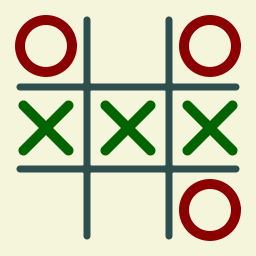

Das erste Beispiel implementiert das Bild _straight-forward_:

```go
package main

import (
	"github.com/stefan-muehlebach/gg"
	"github.com/stefan-muehlebach/gg/colornames"
)

func main() {
    gc := gg.NewContext(256, 256)
    gc.SetFillColor(colornames.Beige)
    gc.Clear()

    gc.SetStrokeColor(colornames.DarkSlateGray)
    gc.SetStrokeWidth(7.0)
    gc.DrawLine( 20, 87, 236, 87)
    gc.DrawLine( 20, 169, 236, 169)
    gc.DrawLine( 87, 20,  87, 236)
    gc.DrawLine(169, 20, 169, 236)
    gc.Stroke()

    gc.SetStrokeColor(colornames.DarkRed)
    gc.SetStrokeWidth(10.0)
    gc.DrawCircle( 46,  46, 26)
    gc.DrawCircle(210, 210, 26)
    gc.Stroke()

    gc.SetStrokeColor(colornames.DarkGreen)
    gc.DrawLine(106, 106, 150, 150)
    gc.DrawLine(106, 150, 150, 106)
    gc.DrawLine( 24, 106,  68, 150)
    gc.DrawLine( 24, 150,  68, 106)
    gc.DrawLine(188, 106, 232, 150)
    gc.DrawLine(188, 150, 232, 106)
    gc.Stroke()

    gc.SavePNG("tictactoe.png")
}
```
Wenn man das Programm ausführt, erscheint im aktuellen Verzeichnis die Datei
`tictactoe.png` mit dem gewünschten Output.
Grundsätzlich könnte man alle Aufgaben auf diese Weise lösen - was jedoch
überhaupt nicht die Intention ist!

Ein erstes Problem sind die vielen Angaben zu Farben, Grössen, Dateinamen
welche quer über den Code verteilt und direkt (d.h. _literal_) verwendet
werden. Möchte man bspw. während der Entwicklung die Farben anpassen, dann
muss man einerseits den gesamten Code nach Farben durchforsten und andererseits
einige Farben (Player1Color, Player2Color) an mehreren Orten angeben.

Fassen wir also in einem ersten Verbesserungsschritt einige Parameter in einem
separaten Variabel-Block vor der main-Funktion zusammen. Damit sind sie auch
visuell gut abgehoben. Bei der Wahl der Variablen-Namen darf man sich ruhig
etwas Zeit lassen und ggf. im weiteren Verlauf des Projektes eine Umbenennung
durchführen.

```go
package main

import (
	"github.com/stefan-muehlebach/gg"
	"github.com/stefan-muehlebach/gg/colornames"
)

var (
	ImageSize     = 256
	BackColor     = colornames.Beige
	LineColor     = colornames.DarkSlateGray
	Player1Color  = colornames.DarkGreen
	Player2Color  = colornames.DarkRed
	GridLineWidth = 7.0
	IconLineWidth = 10.0
	PNGFileName   = "tictactoe.png"
)

func main() {
	gc := gg.NewContext(ImageSize, ImageSize)
	gc.SetFillColor(BackColor)
	gc.Clear()

	gc.SetStrokeColor(LineColor)
	gc.SetStrokeWidth(GridLineWidth)
	gc.DrawLine(20, 87, 236, 87)
	gc.DrawLine(20, 169, 236, 169)
	gc.DrawLine(87, 20, 87, 236)
	gc.DrawLine(169, 20, 169, 236)
	gc.Stroke()

	gc.SetStrokeColor(Player2Color)
	gc.SetStrokeWidth(IconLineWidth)
	gc.DrawCircle(46, 46, 26)
	gc.DrawCircle(210, 210, 26)
	gc.Stroke()

	gc.SetStrokeColor(Player1Color)
	gc.DrawLine(106, 106, 150, 150)
	gc.DrawLine(106, 150, 150, 106)
	gc.DrawLine(24, 106, 68, 150)
	gc.DrawLine(24, 150, 68, 106)
	gc.DrawLine(188, 106, 232, 150)
	gc.DrawLine(188, 150, 232, 106)
	gc.Stroke()

	gc.SavePNG(PNGFileName)
}
```

Halten wir also fest:

> Auf eine saubere Trennung von Code und Daten (in unserem Beispiel sind das
> die Variablen mit den Zeichenparameter) achten. Dies vereinfacht eine
> nachträgliche Anpassung der Parameter.
> Konsistente und im besten Fall selbsterklärende Konstanten- und
> Variablennamen wählen. Also besser 'ImageSize' als 'imgsz'.

In der ersten Bereinigung haben wir uns den statischen Werten angenommen.
Im nächsten Schritt wird der Code dahingehend untersucht,
ob bestimmte Befehle oder Befehlsmuster mehrfach vorkommen. Dies sind dann
Kandidaten, um in eine separate Funktion augelagert zu werden.

Funktionen sind ausserdem ein Werkzeug, um den Code zu strukturieren.
Beispielsweise können alle Befehle, welche das "Spielfeld" zeichnen, in
eine Funktion namens 'DrawGrid' ausgelagert werden. Wählt man den Namen
einer solcher Funktionen geschickt, kann man sogar auf erklärenden Kommentar
verzichten.

In der folgenden Version habe ich weitere Parameter definiert, welche zum
Zeichnen des "Spielfeldes" verwendet werden. Manchmal lohnt es sich, gewisse
Zwischenresultate in eigenen Variablen zu führen (im Beispiel sind dies
'GridPos1' und 'GridPos2') um so den Code übersichtlicher zu gestalten.
Und wie angekündigt wird das Spielfeld in einer eigenen Funktion gepinselt.

```go
package main

import (
	"github.com/stefan-muehlebach/gg"
	"github.com/stefan-muehlebach/gg/colornames"
)

var (
	ImageSize     = 256.0
	MarginSize     = 20.0
	OuterFieldSize = 67.0
	InnerFieldSize = 82.0

	BackColor     = colornames.Beige
	LineColor     = colornames.DarkSlateGray
	Player1Color  = colornames.DarkGreen
	Player2Color  = colornames.DarkRed
	GridLineWidth = 7.0
	IconLineWidth = 10.0
	PNGFileName   = "tictactoe.png"

	GridPos1 = MarginSize + OuterFieldSize
	GridPos2 = GridPos1 + InnerFieldSize
)

func DrawGrid(gc *gg.Context) {
	gc.SetStrokeColor(LineColor)
	gc.SetStrokeWidth(GridLineWidth)
	gc.DrawLine(MarginSize, GridPos1, ImageSize-MarginSize, GridPos1)
	gc.DrawLine(MarginSize, GridPos2, ImageSize-MarginSize, GridPos2)
	gc.DrawLine(GridPos1, MarginSize, GridPos1, ImageSize-MarginSize)
	gc.DrawLine(GridPos2, MarginSize, GridPos2, ImageSize-MarginSize)
	gc.Stroke()
}


func main() {
	gc := gg.NewContext(int(ImageSize), int(ImageSize))
	gc.SetFillColor(BackColor)
	gc.Clear()

	DrawGrid(gc)

	gc.SetStrokeColor(Player2Color)
	gc.SetStrokeWidth(IconLineWidth)
	gc.DrawCircle(46, 46, 26)
	gc.DrawCircle(210, 210, 26)
	gc.Stroke()

	gc.SetStrokeColor(Player1Color)
	gc.DrawLine(106, 106, 150, 150)
	gc.DrawLine(106, 150, 150, 106)
	gc.DrawLine(24, 106, 68, 150)
	gc.DrawLine(24, 150, 68, 106)
	gc.DrawLine(188, 106, 232, 150)
	gc.DrawLine(188, 150, 232, 106)
	gc.Stroke()

	gc.SavePNG(PNGFileName)
}
```

Halten wir also fest:

> Die Parametrisierung kann und soll man sehr weit treiben. Nicht nur einfache
> statische Werte lassen sich damit verwalten, sondern auch abhängige
> Zwischenresultate. Der Code gewinnt damit an Lesbarkeit.
> Ist der Ablauf des Programmes in klare Abschnitte unterteilbar, dann ist
> es meistens von Vorteil, diese in eigenen Funktionen zu implementieren.

Im letzten - und auch anspruchvollsten - Schritt nehmen wir uns den noch
verbleibenden Befehlen an. Sie alle haben mit der Darstellung der Symbole
(Kreuz, Kreis) auf dem Spielfeld zu tun. Um dem Programm eine zusätzliche
Flexibilität zu geben, schlage ich folgendes vor:

- Die Funktion zum Setzen der Spielersymbole soll sich nicht auf das Bild
  aus der Vorlage fixieren, sondern die Möglichkeit bieten, die beiden Symbole
  in irgendeines der 9 vorhanden Felder zu setzen.
- Die Funktion soll nicht mit Pixelkoordinaten arbeiten, sondern mit Spalten-,
  resp. Zeilennummern (es gibt sowohl 3 Spalten als auch 3 Zeilen, welche von
  links oben mit 0, 1, 2 bezeichnet werden).
- Auch die Angabe zum Spielersymbol soll abstrahiert werden, so dass man
  einfach angeben muss, ob für den Spieler 1 oder Spieler 2 etwas gezeichnet
  werden soll.

Das Profil dieser Funktion sollte in etwa so aussehen:

```go
func DrawSymbol(gc *gg.Context, col, row int, player PlayerType) {
    ...
}
```


```go
package main

import (
	"math"

	"github.com/stefan-muehlebach/gg"
	"github.com/stefan-muehlebach/gg/colornames"
)

type PlayerType int

const (
	Player1 PlayerType = iota
	Player2
)

var (
	ImageSize      = 256.0
	MarginSize     = 20.0
	SymbolSize     = 52.0
	SymbolPadding  = 15.0
	OuterFieldSize = 67.0
	InnerFieldSize = 82.0
	BackColor      = colornames.Beige
	LineColor      = colornames.DarkSlateGray
	Player1Color   = colornames.DarkGreen
	Player2Color   = colornames.DarkRed
	GridLineWidth  = 7.0
	SymbolLineWidth  = 10.0
	PNGFileName    = "tictactoe.png"

	GridPos1 = MarginSize + OuterFieldSize
	GridPos2 = GridPos1 + InnerFieldSize
)

func DrawGrid(gc *gg.Context) {
	gc.SetStrokeColor(LineColor)
	gc.SetStrokeWidth(GridLineWidth)
	gc.DrawLine(MarginSize, GridPos1, ImageSize-MarginSize, GridPos1)
	gc.DrawLine(MarginSize, GridPos2, ImageSize-MarginSize, GridPos2)
	gc.DrawLine(GridPos1, MarginSize, GridPos1, ImageSize-MarginSize)
	gc.DrawLine(GridPos2, MarginSize, GridPos2, ImageSize-MarginSize)
	gc.Stroke()
}

func DrawSymbol(gc *gg.Context, col, row int, player PlayerType) {
	x := MarginSize + SymbolSize/2 + float64(col)*(SymbolSize+2*SymbolPadding)
	y := MarginSize + SymbolSize/2 + float64(row)*(SymbolSize+2*SymbolPadding)
	dx := (SymbolSize / 2) * math.Sqrt(3) / 2
	switch player {
	case Player1:
		gc.SetStrokeColor(Player1Color)
		gc.SetStrokeWidth(SymbolLineWidth)
		gc.DrawLine(x-dx, y-dx, x+dx, y+dx)
		gc.DrawLine(x-dx, y+dx, x+dx, y-dx)
		gc.Stroke()
	case Player2:
		gc.SetStrokeColor(Player2Color)
		gc.SetStrokeWidth(SymbolLineWidth)
		gc.DrawCircle(x, y, SymbolSize/2)
		gc.Stroke()
	}
}

func main() {
	gc := gg.NewContext(int(ImageSize), int(ImageSize))
	gc.SetFillColor(BackColor)
	gc.Clear()

	DrawGrid(gc)

	DrawSymbol(gc, 0, 0, Player2)
	DrawSymbol(gc, 2, 0, Player2)
	DrawSymbol(gc, 2, 2, Player2)

	DrawSymbol(gc, 0, 1, Player1)
	DrawSymbol(gc, 1, 1, Player1)
	DrawSymbol(gc, 2, 1, Player1)

	gc.SavePNG(PNGFileName)
}
```

(Stand 24.12.2023) 16 Bilder, welche mit Hilfe
von Go und [gg](https://github.com/stefan-muehlebach/gg) _und so wenig Code
wie möglich_ nachzubilden sind.
Mit entsprechendem Aufwand können alle Bilder durch ein Go-Programm in
Form einer laaaaaaangen Liste von Zeichenbfehlen erstellt werden - das ist
jedoch nicht das Ziel!
Allen Graphiken liegt ein bestimmter algorithmischer Aufbau zugrunde.
Das heisst, mit geschickter Verwendung von Schlaufen, Iterationen und weiteren
Programmiertechniken, lässt sich der Aufwand massiv verkleinern.

## Erste und wichtigste Schritte

Dieser Abschnitt erklärt, wie die Programme zur Erzeugung von PNG-Dateien
grundsätzlich aufgebaut sind, welche Einstellungen (Grössen, Farben, etc) zu
verwenden sind und zeigt Schritt für Schritt wie ein einfaches Bild erstellt
werden kann.

## Liste der Aufgaben

### Irrgarten

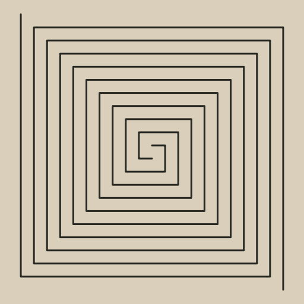

### Spirale

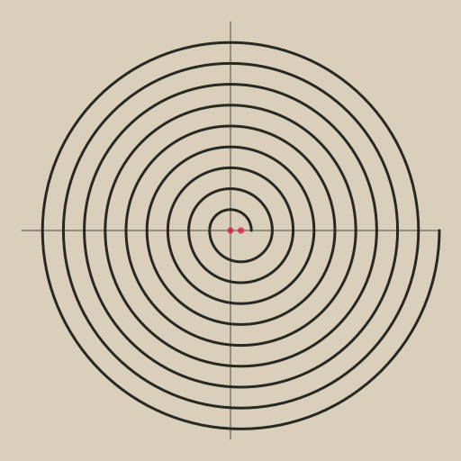

### Schachbrett

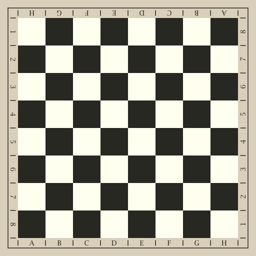

### Moirée (optische Täuschung)

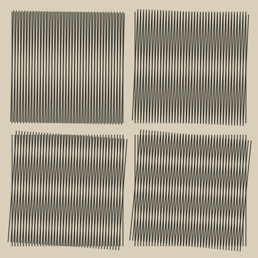

### Verschachtelte Quadrate

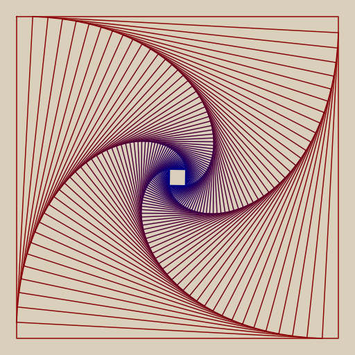

### Bauhaus-Muster

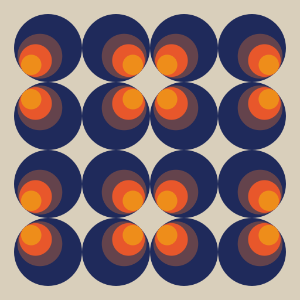

### Prim-Kreise

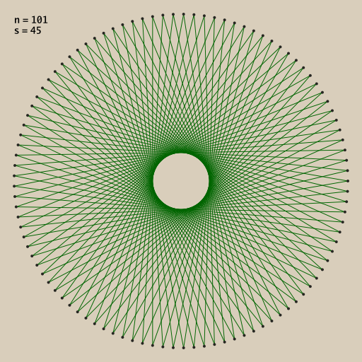

### Kardioide

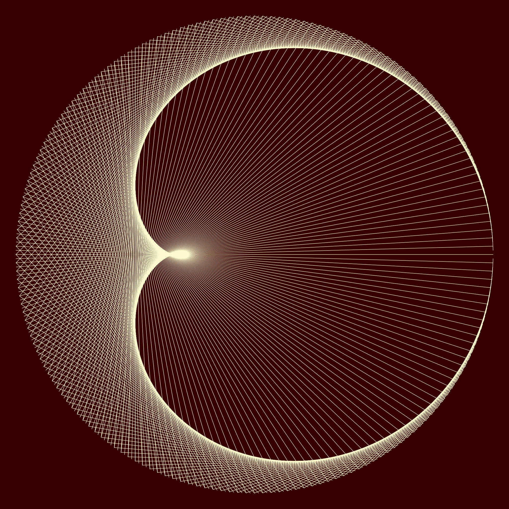

### 3D Kugel

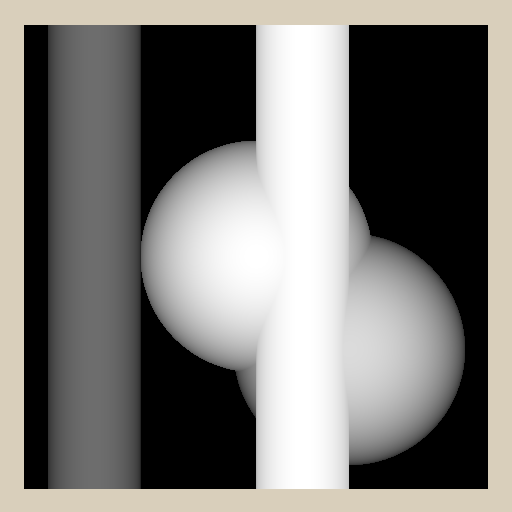

### Text Transformationen

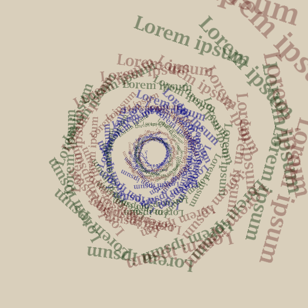

### Farn-Fraktal

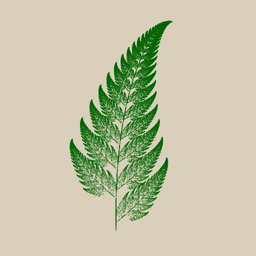

### Raster oder Halbtonbilder

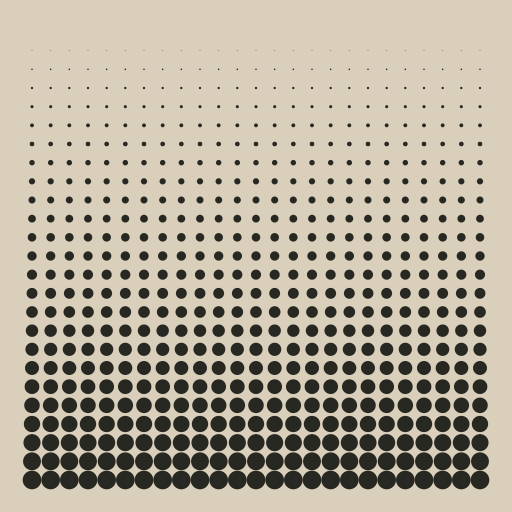 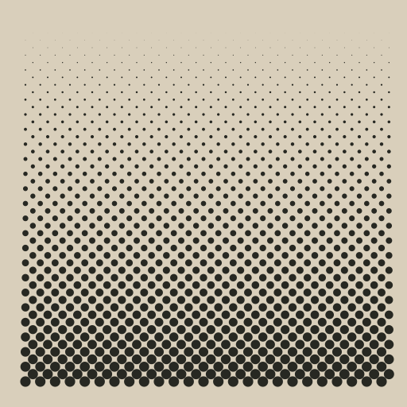 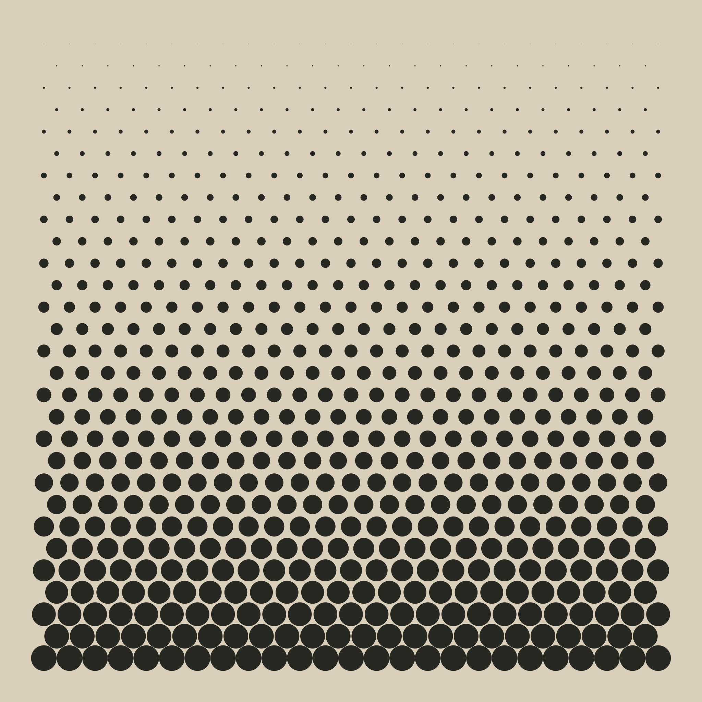
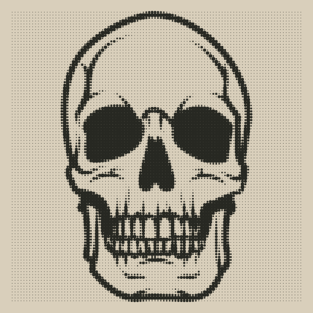 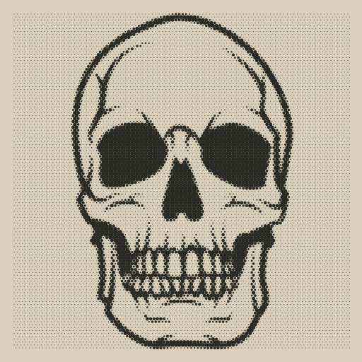

### Farbzellen

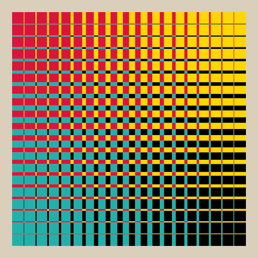

### Relief mit Zufallszahlen

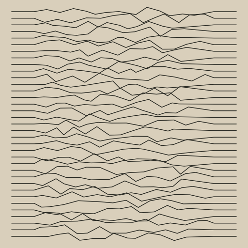

### Die Blume des Lebens

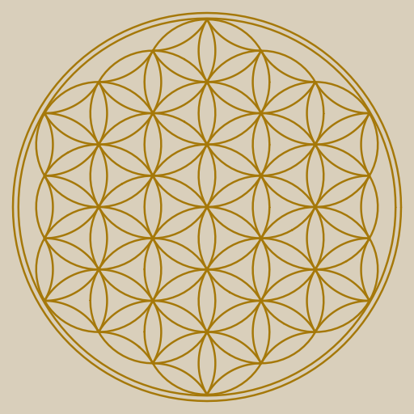
