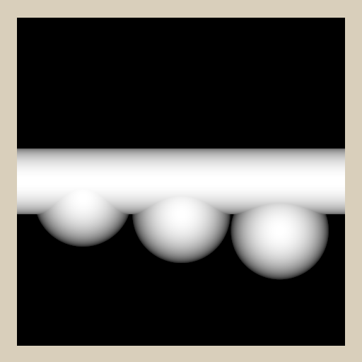
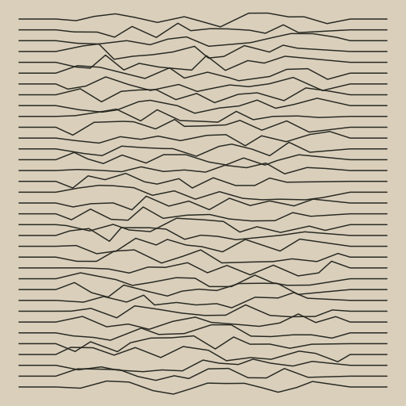

# Graphische Trainingseinheiten

In diesem Verzeichnis sind mehrere Aufgaben enthalten, die graphisch
implementiert werden müssen. Zu den einzelnen Aufgaben gibt es nur wenige
Erklärungen in schriftlicher Form, die zentrale Aufgabenstellung ist die
Bildvorlage. Das Ziel ist, jedes gezeigte Bild mit einem eigenständigen
Go-Programm nachzuzeichnen. Dabei gilt es auf Folgendes zu achten:

* Wie stark gleichen sich die beiden Bilder (die Vorlage und das selbst
  erstellte)?
* Ist der Code so sparsam/kurz/ökonomisch wie möglich?
* Sind alle Redundanzen eliminiert?
* Wurden zur Steuerung, resp. Modifikation des Bildes Parameter eingesetzt?

## TicTacToe

Anhand eines Beispiels möchte ich zeigen, wie ich mir das genau vorstelle.
Für das folgende Bild (ein angefangenes TicTacToe) werde ich nacheinander
mehrere Go-Programme erstellen. In jeder Iteration wird der Code kompakter,
generischer und besser.

Die Vorlagen sind immer quadratisch und als Breite empfiehlt sich eine Zahl
zwischen 300 und 1000. Am Schönsten sind natürlich 2er Potenzen wie 256, 512
oder 1024.


```go
package main

import (
	"github.com/stefan-muehlebach/gg"
	"github.com/stefan-muehlebach/gg/colornames"
)

func main() {
    gc := gg.NewContext(256, 256)
    gc.SetFillColor(colornames.Beige)
    gc.Clear()

    gc.SetStrokeColor(colornames.DarkSlateGray)
    gc.SetStrokeWidth(7.0)
    gc.DrawLine( 20, 87, 236, 87)
    gc.DrawLine( 20, 169, 236, 169)
    gc.DrawLine( 87, 20,  87, 236)
    gc.DrawLine(169, 20, 169, 236)
    gc.Stroke()

    gc.SetStrokeColor(colornames.DarkRed)
    gc.SetStrokeWidth(10.0)
    gc.DrawCircle( 46,  46, 26)
    gc.DrawCircle(210, 210, 26)
    gc.Stroke()

    gc.SetStrokeColor(colornames.DarkGreen)
    gc.DrawLine(106, 106, 150, 150)
    gc.DrawLine(106, 150, 150, 106)
    gc.DrawLine( 24, 106,  68, 150)
    gc.DrawLine( 24, 150,  68, 106)
    gc.DrawLine(188, 106, 232, 150)
    gc.DrawLine(188, 150, 232, 106)
    gc.Stroke()

    gc.SavePNG("tictactoe.png")
}
```
Wenn man das Programm ausführt, erscheint im aktuellen Verzeichnis die Datei
`tictactoe01.png` mit dem gewünschten Output.
Grundsätzlich könnte man alle Aufgaben auf diese Weise lösen - was jedoch
überhaupt nicht die Intention ist!

Ein erstes Problem sind die vielen Angaben (wie Farben, Grössen, Dateinamen)
welche quer über den Code verteilt und direkt (d.h. literal) verwendet werden.
Möchte man bspw. während der Entwicklung die Farben anpassen, dann muss man
einerseits den gesamten Code nach Farben durchforsten und andererseits einige
Farben (Player1Color, Player2Color) an mehreren Orten angeben.

Fassen wir also in einem ersten Verbesserungsschritt Parameter in einem
separaten Variabel-Block vor der main-Funktion zusammen. Damit sind sie auch
visuell gut abgehoben. Bei der Wahl der Variablen-Namen darf man sich ruhig
etwas Zeit lassen und ggf. im weiteren Verlauf des Projektes eine Umbenennung
durchführen.

```go
package main

import (
	"github.com/stefan-muehlebach/gg"
	"github.com/stefan-muehlebach/gg/colornames"
)

var (
	ImageSize     = 256
	BackColor     = colornames.Beige
	LineColor     = colornames.DarkSlateGray
	Player1Color  = colornames.DarkGreen
	Player2Color  = colornames.DarkRed
	GridLineWidth = 7.0
	IconLineWidth = 10.0
	PNGFileName   = "tictactoe.png"
)

func main() {
	gc := gg.NewContext(ImageSize, ImageSize)
	gc.SetFillColor(BackColor)
	gc.Clear()

	gc.SetStrokeColor(LineColor)
	gc.SetStrokeWidth(GridLineWidth)
	gc.DrawLine(20, 87, 236, 87)
	gc.DrawLine(20, 169, 236, 169)
	gc.DrawLine(87, 20, 87, 236)
	gc.DrawLine(169, 20, 169, 236)
	gc.Stroke()

	gc.SetStrokeColor(Player2Color)
	gc.SetStrokeWidth(IconLineWidth)
	gc.DrawCircle(46, 46, 26)
	gc.DrawCircle(210, 210, 26)
	gc.Stroke()

	gc.SetStrokeColor(Player1Color)
	gc.DrawLine(106, 106, 150, 150)
	gc.DrawLine(106, 150, 150, 106)
	gc.DrawLine(24, 106, 68, 150)
	gc.DrawLine(24, 150, 68, 106)
	gc.DrawLine(188, 106, 232, 150)
	gc.DrawLine(188, 150, 232, 106)
	gc.Stroke()

	gc.SavePNG(PNGFileName)
}
```

```go
package main

import (
	"math"

	"github.com/stefan-muehlebach/gg"
	"github.com/stefan-muehlebach/gg/colornames"
)

type PlayerType int

const (
	Player1 PlayerType = iota
	Player2
)

var (
	ImageSize      = 256.0
	MarginSize     = 20.0
	IconSize       = 52.0
	IconPadding    = 15.0
	OuterFieldSize = 67.0
	InnerFieldSize = 82.0
	BackColor      = colornames.Beige
	LineColor      = colornames.DarkSlateGray
	Player1Color   = colornames.DarkGreen
	Player2Color   = colornames.DarkRed
	GridLineWidth  = 7.0
	IconLineWidth  = 10.0
	PNGFileName    = "tictactoe.png"

	gc       *gg.Context
	GridPos1 = MarginSize + OuterFieldSize
	GridPos2 = GridPos1 + InnerFieldSize
)

func DrawGrid() {
	gc.SetStrokeColor(LineColor)
	gc.SetStrokeWidth(GridLineWidth)
	gc.DrawLine(MarginSize, GridPos1, ImageSize-MarginSize, GridPos1)
	gc.DrawLine(MarginSize, GridPos2, ImageSize-MarginSize, GridPos2)
	gc.DrawLine(GridPos1, MarginSize, GridPos1, ImageSize-MarginSize)
	gc.DrawLine(GridPos2, MarginSize, GridPos2, ImageSize-MarginSize)
	gc.Stroke()
}

func DrawIcon(col, row int, player PlayerType) {
	x := MarginSize + IconSize/2 + float64(col)*(IconSize+2*IconPadding)
	y := MarginSize + IconSize/2 + float64(row)*(IconSize+2*IconPadding)
	dx := (IconSize / 2) * math.Sqrt(3) / 2
	switch player {
	case Player1:
		gc.SetStrokeColor(Player1Color)
		gc.SetStrokeWidth(IconLineWidth)
		gc.DrawLine(x-dx, y-dx, x+dx, y+dx)
		gc.DrawLine(x-dx, y+dx, x+dx, y-dx)
		gc.Stroke()
	case Player2:
		gc.SetStrokeColor(Player2Color)
		gc.SetStrokeWidth(IconLineWidth)
		gc.DrawCircle(x, y, IconSize/2)
		gc.Stroke()
	}
}

func main() {
	gc = gg.NewContext(int(ImageSize), int(ImageSize))
	gc.SetFillColor(BackColor)
	gc.Clear()

	DrawGrid()

	DrawIcon(0, 0, Player2)
	DrawIcon(2, 0, Player2)
	DrawIcon(2, 2, Player2)

	DrawIcon(0, 1, Player1)
	DrawIcon(1, 1, Player1)
	DrawIcon(2, 1, Player1)

	gc.SavePNG(PNGFileName)
}
```

(Stand 24.12.2023) 16 Bilder, welche mit Hilfe
von Go und [gg](https://github.com/stefan-muehlebach/gg) _und so wenig Code
wie möglich_ nachzubilden sind.
Mit entsprechendem Aufwand können alle Bilder durch ein Go-Programm in
Form einer laaaaaaangen Liste von Zeichenbfehlen erstellt werden - das ist
jedoch nicht das Ziel!
Allen Graphiken liegt ein bestimmter algorithmischer Aufbau zugrunde.
Das heisst, mit geschickter Verwendung von Schlaufen, Iterationen und weiteren
Programmiertechniken, lässt sich der Aufwand massiv verkleinern.

## Erste und wichtigste Schritte

Dieser Abschnitt erklärt, wie die Programme zur Erzeugung von PNG-Dateien
grundsätzlich aufgebaut sind, welche Einstellungen (Grössen, Farben, etc) zu
verwenden sind und zeigt Schritt für Schritt wie ein einfaches Bild erstellt
werden kann.

Die Programme habe alle

## List der Aufgaben

    
 
       








